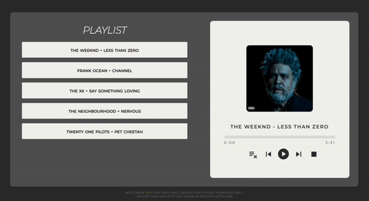

# Media Player
Um player de músicas!

### Tecnologias:
HTML,
CSS e
JavaScript

  ### Desafios
  A barra de progresso foi um desafio e tanto, mas nada comparado a escolher a música através da lista, sem mudar a ordem de reprodução. Para isso encontrei a seguinte solução: 
 ~~~
  musicQueue.addEventListener('click', (e) => {
  let obj = songList.findIndex((obj) => obj.title === e.target.innerText);
  index = obj;
  song.src = songList[index].src;
});
~~~

Funcionou:

|   Selecionando música da lista:   |   Visualizando a próxima música quando o player está expandido:   |
| :-------------------------------: | :-----------------------------: |
|  |  |

### Veja em funcionamento:
 <a href="https://m0nicavaz.github.io/mediaPlayer/"> Media Player </a> 
